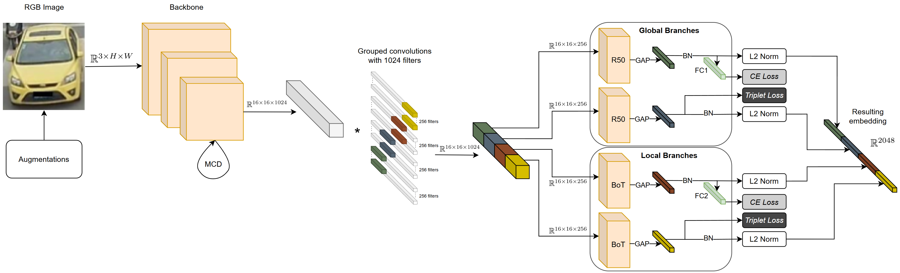

# 🚗 Vehicle Re-Identification on Aerial Imagery

[](https://www.python.org/downloads/)
[](https://pytorch.org/)



A deep learning framework for vehicle re-identification (V-ReID) that extracts discriminative embeddings from vehicle images to compute similarity measures between image pairs. This implementation modifies the multi-branch architecture from "Strength in Diversity" paper with enhanced caching mechanisms and training optimizations.

## ✨ Key Features

- Hybrid ResNet + BoTNet architecture with self-attention
- Multi-branch learning with combined Triplet + Cross-Entropy losses
- Optimized caching system for efficient data loading
- Monte-Carlo dropout for robust predictions
- Efficient inference for real life usage

## 📝 Project Overview

This project develops an efficient vehicle re-identification system for urban surveillance and autonomous vehicle applications. The model addresses:

- High inter-class similarity between different vehicles
- Large intra-class variations due to viewpoints/lighting
- Computational constraints for real-world deployment

## 🛠️ Installation

```bash
python3 -m venv .venv
source .venv/bin/activate
pip install -r requirements.txt
```

## 🚀 Usage

### Training
```console
python3 train.py --config config/config_MBR_4G_IBN.yaml
```

### Testing
```console
python3 test.py --path_weights logs/Veri776/MBR_4G/IBN_337x311/best_mAP.pt
```

## 📊 Benchmark Results (VeRi-776)

| Metric          | Value   | Improvement |
|-----------------|:-------:|:-----------:|
| mAP             | 83.91%  | ↑ +1.24%    |
| CMC@1           | 97.14%  | ↑ +0.12%    |
| CMC@5           | 98.81%  | → ±0.0%     |
| Num params      | 12.9M   | → No change |
| Inference speed | 752 img/sec |            |

*Benchmarked on NVIDIA RTX 4070 Ti SUPER, AMD Ryzen 7 3700X*

📦 Model weights available [here](https://disk.360.yandex.ru/d/uASvBKYCit8rSA).

## 🏆 Key Improvements

- Training optimization with limited caching
- Sawtooth learning rate scheduler
- Proportional image scaling
- Data-aware scaling
- MixUp augmentations
- Monte-Carlo dropout (30 iterations, p=0.2)

## 📚 Citation

This work builds upon the following research:

```bibtex
@inproceedings{almeida2023strength,
  title={Strength in diversity: Multi-branch representation learning for vehicle re-identification},
  author={Almeida, Eurico and Silva, Bruno and Batista, Jorge},
  booktitle={2023 IEEE 26th International Conference on Intelligent Transportation Systems (ITSC)},
  pages={4690--4696},
  year={2023},
  organization={IEEE}
}
```

## 🔮 Future Work

- Integration of Visual Mamba and DinoV2 backbones
- Spatial-temporal feature fusion
- Adversarial AutoMix augmentations
- Multi-dataset training for robust features

## 📜 License

MIT License - See [LICENSE](LICENSE) file for details.  
